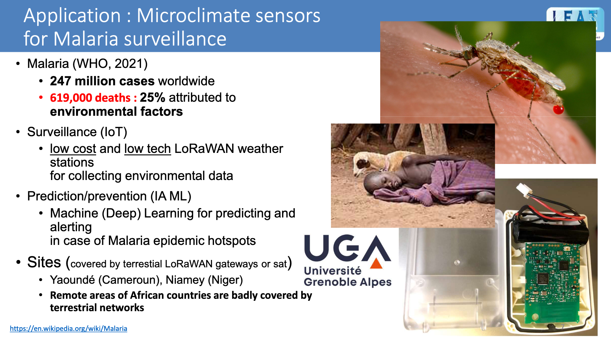

# I2HM (Internet of things and artificial Intelligent for Health monitoring)

Transmission of malaria depends on the complex interaction between the environment, humans, and infected vectors. Malaria, Zika, Chikungunya, Dengue, Lyme disease ... vector-borne diseases are infectious diseases transmitted by "vectors," mainly insects and hematophagous mites, including mosquitoes and ticks. According to the World Health Organization (WHO 2022), these vector-borne diseases are responsible for over a million deaths each year. They are recognized as a major public health problem, both internationally and with increasing importance due to intensified globalization of trade and human movement, as well as climate change, among other factors.

The project I2HM proposes to use georeferenced connected sensors (IoT) to collect environmental data in near real-time. The devices we intend to deploy include temperature and humidity sensors for ambient air, sunlight level, precipitation rate, water pH sensors, mosquito traps, odor probes, and more. Sensor measurements are transmitted throught LoRaWAN terrestrial networks (public or private) or throught satellite IoT networks (SatIoT) and then archived as time-series in geodatabases.

Georeferenced sensor data are immedialy processed for training machine learning algorithms and for predicting in real-time high-risk areas and make recommendations.

Sensors are designed according the low tech manifesto in order to be maintable on site and to involve the citizen in sensor data collection.

Additionally, the proposed system ensures better support by deploying preventive solutions that can be reused for the surveillance of other diseases such as meningitis and respiratory pathologies related to particle matter (PM) pollution.

Contact : Didier DONSEZ @ Université Grenoble Alpes

[Github repositories](https://github.com/i2hm/)

